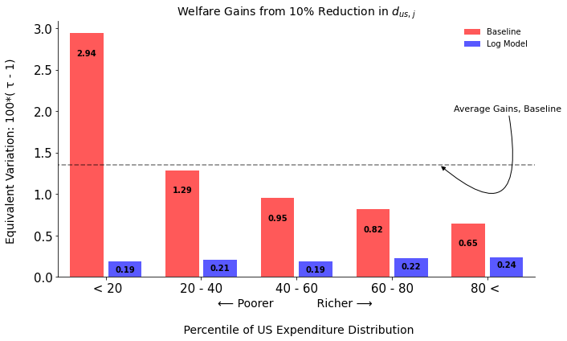

# HAT: Heterogenous Agent Trade

  
   

This repository contain code associated with the paper [Heterogenous Agent Trade](./notes/heterogeneous-agent-trade.pdf).

**This is a work in progress. Please let me know of any problems. Functionality may change rapidly.**

---

### What is HAT?

HAT is a model where aggregate trade arises from the explicit aggregation of household-level decisions.

Households live lives similar to the "standard incomplete markets model" where agents face to idiosyncratic productivity and taste shocks (a new part) and have access to a risk free asset. Trade in goods follows the Armington tradition  with producers in each country producing a national variety. A Ricardian version is in progress.

The **twist** is that households have random utility over these varieties and they make a discrete choice over the varieties to consume in addition to their savings decisions. The explicit aggregation of household-level decisions then determines aggregate trade flows, trade elasticities, and the gains from trade.

I view HAT (and related models) as providing a foundation to systematically think about the distributional affects of trade reforms, their dynamics, and complementary policies to mitigate the downsides of globalization.  

HAT also provides a laboratory where there is non-trivial connection between international trade and finance. Issues such as sequencing of reforms (trade or capital account first) and the value of those reforms, the distributional issues of those reforms are all natural questions to ask of this framework. I might get to it one day.

---

### How?

The goal here is to provide code and informative notebooks to illustrate how things work. 

The base code is in [julia](https://github.com/JuliaLang) (there is a python version but it needs to be updated) with the goal of implementing things using transparent and well developed methods. Most the notation in the code tries to closely follow the paper. 

This is still preliminary but below are core elements of the code:

- [ha-trade-environment.jl](./code/julia/ha-trade-environment.jl) is behind the household problem and the environment it faces. 

- [ha-trade-solution.jl](./code/julia/ha-trade-solution.jl) provides method to solve the household problem in one country, find the stationary distribution within a country, find a world equilibrium.

- [two-country.ipynb](./notebooks/two-country.ipynb) is a jupyter notebook that runs through a two country example of how (some) things work. 

- [log-model.ipynb](./notebooks/log-model.ipynb) is a jupyter notebook that runs through a two country example with log preferences and illustrating how the model collapses to a constant elasticity model.

---

### Want to know more?

Much of this is a continuation of my thinking across several papers that connect models of household heterogeneity with trade:

- [Lyon and Waugh (2019)](https://www.waugheconomics.com/uploads/2/2/5/6/22563786/lw_quant_losses.pdf) and [Lyon and Waugh (2018) JIE](https://www.waugheconomics.com/uploads/2/2/5/6/22563786/lw_tax.pdf) are precursors to this work.

- Waugh (2023) (an evolution of [Waugh (2019)](https://www.waugheconomics.com/uploads/2/2/5/6/22563786/waugh_consumption.pdf)) is an example as well.

- And it connects (and in someways is a companion paper) to my paper [Pricing Inequality](http://www.simonmongey.com/uploads/6/5/6/6/65665741/mw_2022_11_16_minneapolis_fed_online.pdf) with Simon Mongey. 

---

### Support and Disclaimers

This project was developed with research support from the [National Science Foundation (NSF Award number 1948800)](https://www.nsf.gov/awardsearch/showAward?AWD_ID=1948800&HistoricalAwards=false). 

The views expressed herein are those of the author and not necessarily those of the Federal Reserve Bank of Minneapolis or the Federal Reserve System. 