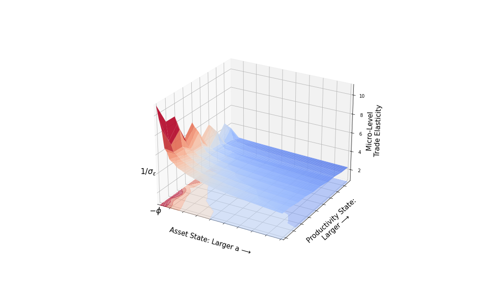

# HAT --- Heterogeneous Agent Trade

   

This repository contain code associated with the paper [Heterogeneous Agent Trade](./notes/heterogeneous-agent-trade.pdf). Please let me know of any problems.

---

### What is HAT?

HAT is a model where aggregate trade arises from the explicit aggregation of household-level decisions.

Households live lives similar to the "standard incomplete markets model" where agents face to idiosyncratic productivity and taste shocks (a new part) and have access to a risk free asset. Trade in goods follows the Armington tradition  with producers in each country producing a national variety.

The **twist** is that I do not employ modeling techniques with aggregation at the household level across national varieties, and instead I have households make a discrete choices over the varieties they consume in addition to their savings decisions. The explicit aggregation of household-level decisions then determines aggregate trade flows, trade elasticities, and the gains from trade.

I view HAT (and related models) as a new way to think about the distributional affects of trade reforms, their dynamics, and complementary policies to mitigate the downsides of globalization.  

HAT also provides a laboratory where there is non-trivial connection between international trade and finance. Issues such as sequencing of reforms (trade or capital account first) and the value of those reforms, the distributional issues of those reforms are all natural questions to ask of this framework. I might get to it one day.

---

### How?

The goal here is to provide code and informative notebooks to illustrate how things work. 

The base code is in [julia](https://github.com/JuliaLang) with the goal of implementing things using transparent and well developed methods. Most the notation in the code tries to closely follow the paper. In the repository there are also [python versions](./code/python) of the code. Results are plotted in jupyter notebooks (python).

**Replicating results in the paper.**  

Here are the files:

- [two-country.ipynb](./notebooks/two-country.ipynb) is a jupyter notebook (julia) used to compute a symmetric two country model and illustrate some properties as to how everything works. Figure 1a and Figure 1b are then created from the output and this is plotted in a jupyter notebook (python) in [plot-micro-elasticity.ipynb](./notebooks/plot-micro-elasticity.ipynb).

- [calibrate-gravity-as-guide.jl](./code/julia/calibrate-gravity-as-guide.jl) is one of the main driver files to calibrate the model as described in the paper. If one were to run it, this takes time and resources. 

- [calibrate-all.jl](./code/julia/calibration-all.jl) is an alternative and much faster approach to calibrating the model. It looks for a parameter vector and a vector of wages and an interest rate that satisfies (i) the moment conditions and (ii) that markets clear, all in one step. It is, however, far more sensitive to the initial guess for parameters and prices.

- [coumpute-baseline.jl](./code/julia/compute-baseline.jl) generates moments from the EK data set, takes in calibrated parameter values, and computes a world equilibrium. Outcomes are then compared to the data, i.e., plot trade in the model vs. the data (Figure 2), the trade elasticities (Figure 3), and micro moments are reported. The plotting file is [plot-calibration.ipynb](./notebooks/plot-calibration.ipynb).

- [coumpute-baseline-log.jl](./code/julia/compute-baseline-log.jl) same thing as above, but now for the log preference case.

- [log-model.ipynb](./notebooks/log-model.ipynb) is a jupyter notebook that runs through a two country example with log preferences and illustrates how the model collapses to a constant elasticity model. The jupyter notebook (python)  [plot-micro-elasticity-log.ipynb](./notebooks/plot-micro-elasticity-log.ipynb) plots the results.

- [coumpute-welfare.jl](./code/julia/compute-welfare/compute-welfare.jl) computes the baseline, the counterfactual equilibrium with a unilateral reduction of trade costs by 10 percent, then constructs welfare measures and saves the results. The [``-log``](./code/julia/compute-welfare/compute-welfare-log.jl)  version does the same for the log model. The jupyter notebook (python) [plot-welfare.ipynb] plots the results (Figure 4).

- [coumpute-welfare-global.jl](./code/julia/compute-welfare/compute-welfare.jl) computes the baseline, the counterfactual equilibrium with a global reduction of trade costs by 10 percent, then constructs welfare measures and saves the results. The [``-log``](./code/julia/compute-welfare/compute-welfare-global-log.jl)  version does the same for the log model. The jupyter notebook (python) [plot-welfare-global.ipynb] plots the results (Figure 5).

**More about the code.** 

Here are core elements of the code:

- [ha-trade-environment.jl](./code/julia/ha-trade-environment.jl) is behind the household problem and the economic environment it faces. 

- [ha-trade-solution.jl](./code/julia/ha-trade-solution.jl) provides methods to solve the household problem in one country, methods to construct the stationary distribution within a country, and methods to find a world equilibrium.

- [ha-trade-calibrate.jl](./code/julia/ha-trade-calibrate.jl) contains functions used to calibrate the model.

- [ha-trade-welfare.jl](./code/julia/ha-trade-calibrate.jl) contains functions used to measure welfare in the model.

- [ha-trade-elasticity.jl](./code/julia/ha-trade-calibrate.jl) contains functions used to compute elasticities at the micro and macro level. 

- [ha-trade-helper-functions.jl](./code/julia/ha-trade-calibrate.jl) contains functions used to help out. 

- [gravity-tools.jl](./code/julia/ha-trade-calibrate.jl) contains functions used to manipulate trade data and run gravity regressions.

---

### Want to know more?

Much of this is a continuation of my thinking across several papers that connect models of household heterogeneity with trade:

- [Lyon and Waugh (2019)](https://www.waugheconomics.com/uploads/2/2/5/6/22563786/lw_quant_losses.pdf) and [Lyon and Waugh (2018) JIE](https://www.waugheconomics.com/uploads/2/2/5/6/22563786/lw_tax.pdf) are precursors to this work.

- Waugh (2023) (an evolution of [Waugh (2019)](https://www.waugheconomics.com/uploads/2/2/5/6/22563786/waugh_consumption.pdf)) is an example as well.

- And it connects to my papers on general equilibrium discrete choice models [Pricing Inequality](http://www.simonmongey.com/uploads/6/5/6/6/65665741/mw_2022_11_16_minneapolis_fed_online.pdf) and [Discrete Choice, Complete Markets, and Equilibrium](https://www.waugheconomics.com/uploads/2/2/5/6/22563786/dce-sed.pdf) with Simon Mongey. 

---

### Support and Disclaimers

This project was developed with research support from the [National Science Foundation (NSF Award number 1948800)](https://www.nsf.gov/awardsearch/showAward?AWD_ID=1948800&HistoricalAwards=false). 

The views expressed herein are those of the author and not necessarily those of the Federal Reserve Bank of Minneapolis or the Federal Reserve System. 